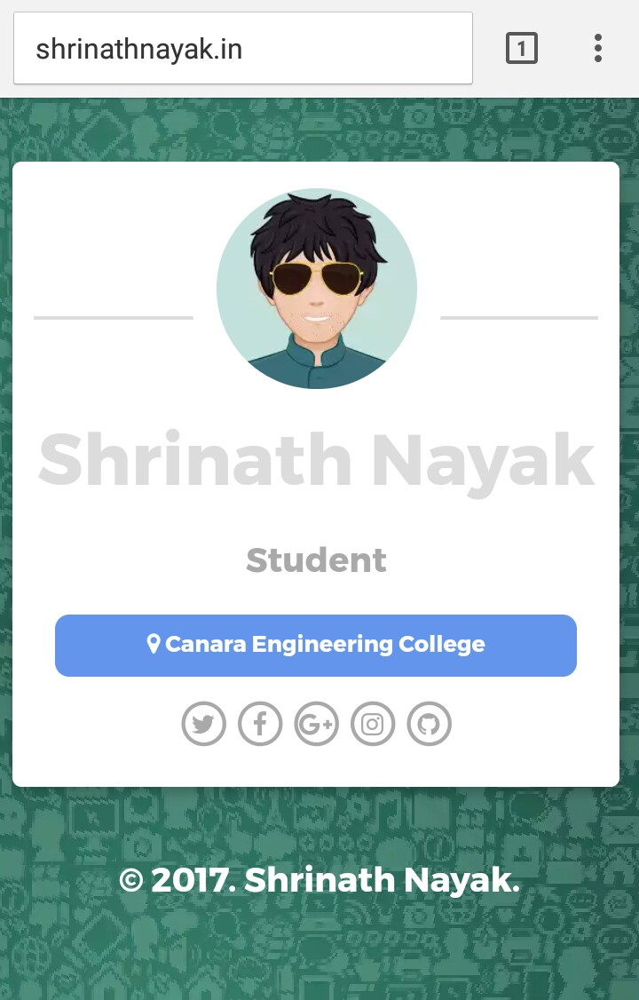

# One Page responsive template
<h3>This is a responsive template specially designed for designers.</h3>
<h4>I have tried to implement Material Design in it. Hope you like it.</h4>

 External libraries used:
<ul>
<li><h6>Animate.css for animations</h6></li>
<li><h6>Font-Awesome for icons</h6></li>
</ul>

<h2>Preview <a href="http://www.shrinathnayak.in"> Click Here</a></h2>
<h5>for more queries or any details <a href="mailto:shrinathnayak07@gmail.com">mail</a></h5>

<h4>This is the desktop view<h4>

<h4>This is the Mobile view<h4>

<h3>Thank You for checking out this template.</h3>
